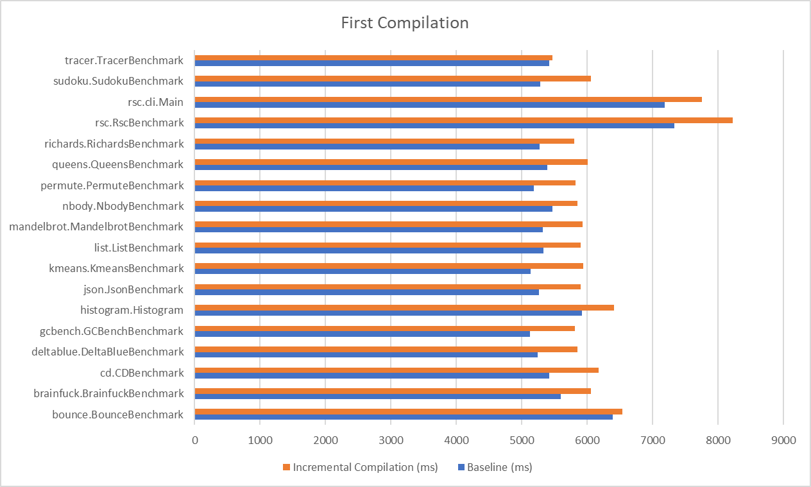
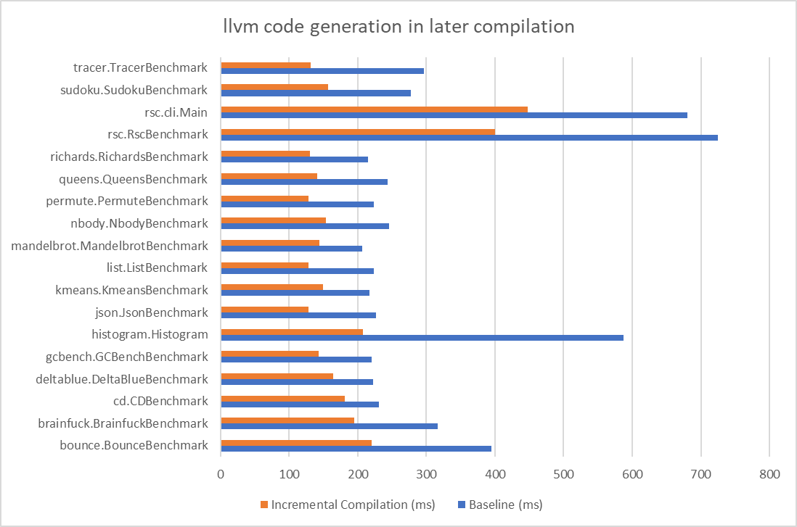

# Optimization of Scala Native linker

## 1. Introduction

Scala Native is an optimizing ahead-of-time compiler for scala. Traditional scala code is compiled to jvm-interpretable bytecode, while Scala Native directly compiles scala code to binaries. Here are two main steps in Scala Native to compile the scala code to binaries: first the scala code is compiled to `nir` by NIR compiler; second `nir` code is loaded, optimized and transformed to `llvm-ir` code by Scala Native Linker. During the GSoC period, my task is to investigate how to speed up Scala Native Linker. Here are four products in my project: 

* Build benchmarks for evaluating the performance of Scala Native, and automatic test script to measure the compilation and and runtime performance

* Introduce incremental compilation to Scala Native, which reduces the build time by 21% on average. 

* Profile the optimizer of Scala Native. Based on the profile result, we decrease the memory cost and fix the issue that Scala Native is stuck when compiling very large projects on release mode.

* Investigate the feasibility of parallel optimization. The conclusion is that parallel optimization is nontrivial to implement in the current Scala Native optimizer. Finally we will give some possible solutions to do parallel optimization in the future.

# 2. Scala Native Benchmark Evaluation

## 2.1 Introduction to Scala Native Autotest

[Scala Native Autotest](https://github.com/yuly16/incremental-compilation-autotest) is the tool we created to automatically test the performance of Scala Native. The usage of the script is:

```
./autotest --scala SCALA-VERSION --scala-native SCALA-NATIVE-VERSION --benchmark-list <benchmarks list or non to run all>
```

And then the compilation and runtime time cost are collected in a csv file, which makes it easier to analyze our changes to Scala Native. 

The scala code benchmark contains 18 scala projects refered from the [original Scala Native Benchmarks](https://github.com/scala-native/scala-native-benchmarks). The benchmark is listed below:

```
[1] bounce.BounceBenchmark
[2] brainfuck.BrainfuckBenchmark
[3] cd.CDBenchmark
[4] deltablue.DeltaBlueBenchmark
[5] gcbench.GCBenchBenchmark
[6] histogram.Histogram
[7] json.JsonBenchmark
[8] kmeans.KmeansBenchmark
[9] list.ListBenchmark
[10] mandelbrot.MandelbrotBenchmark
[11] nbody.NbodyBenchmark
[12] permute.PermuteBenchmark
[13] queens.QueensBenchmark
[14] richards.RichardsBenchmark
[15] rsc.RscBenchmark
[16] rsc.cli.Main
[17] sudoku.SudokuBenchmark
[18] tracer.TracerBenchmark
```

The workflow of compiling each benchmark project is:

* Warm up the sbt: clean the project and compile it
* Calculate the time cost of the first compilation: clean the project and compile it. 
* Calculate the time cost of the second compilation: we change a line in the project. This time we don't clean the projectm, and just recompile it. 
* After compile all benchmark projects, we test the time cost of binaries they produce. 

The autotest script is used to test the performance of Incremental Compilation, which we will discuss below. 

## 2.2 Implementation
This section is helpful if anyone would like to debug or modify the autotest script. We write a `build.sbt` template in the `template` directory. This template does sbt warm-up and two compilations for every project that needs to test. However, the template can not be executed by sbt directly, since we set some placeholders in it. The `autotest` script replaces placeholders to input parameters, for example, the current Scala version, Scala Native version and benchmarks that need to test. `generate_csv.py` collects the compilation output and generates a report about the performance of Scala native. 

# 3. Incremental Compilation

Incremental Compilation is the technique that accelerates the compilation if here are little changes between two compilations in a project. Generally when developing softwares, programmers follow edit-compile-run cycles: we change some source codes in the program, compile and execute it to see runtime results, and then repeat the steps above until we get the expected output. Incremental Compilation is based on a straightforward idea: we don't need to recompile the whole project if changes in the edit phase are not numerous. Instead, only recompile the changed libraries or packages, which would notably decrease the compilation time. 

A non-trivial topic in the Incremental Compilation is how to detect the change of the code. One simple method is to record the hash code of each file and compare them with file hash codes in the last compilation. However, this method doesn't work in Scala Native. The reason is that Scala Native filters out the unused functions when compiling `nir` files to `llvm-ir` files. Here is a case: the package `A` is not changed between two compilations, but a function `foo` in the package `A` is used in the second compilation. If `foo` is not used in the first compilation, we have to recompile package `A`, because `foo` is omitted by Scala Native Linker in the first compilation. 

Therefore, we collect the hash code of each definition after loading and optimizing `nir` code. We compare hash codes with the previous compilation and select definitions that are changed. Fortunately, the definitions in Scala Native are represented by case class or case object, which makes easier to compute the hash code, since the hash code of case class or case object in Scala remains the same in different executions. 

Another important factor is the granularity of the Incremental Compilation. Initially we set the granularity as class and generate one `llvm-ir` file for each class. A `llvm-ir` file should be recompiled if its conrresponding class has changed definitions. However, it introduces high overheads on the first compilation, since a project usually has hundreds or even thousands of classes, so we have to compile hundreds or thousands of `llvm-ir` files in the first compilation. Therefore, finally we set the granularity as package, which introduces negligible overheads on the first compilation, and has remarkable improvement on later compilations. 

We test the performance of Incremental Compilation on the Scala Native benchmark that we discussed in the second section. The baseline is the original Scala Native version. All experiments are done in debug mode, because Incremental Compilation is mainly used in debug mode. First we compare the time cost of the first compilation between Incremental Compilation and baseline, and then change a line in the project and compare the time cost of second compilation. 

The comparison in the first compilation: 


The blue line is the time cost of baseline, and the orange line is the time cost of Incremental Compilation. The overhead in the Incremental Compilation is caused by generating more `llvm-ir` files than the baseline. The number of `llvm-ir` files in baseline equals to the number of CPU cores, while the number in Incremental Compilation version equals to the number of packages in the project. 

The comparison in the later compilations: 


The average improvement of Incremental Compilation is 21%, which has already surpassed 20%, the expected result in my GSoC proposal. 

The steps that Scala Native Linker compiles `nir` is: 
* Link `nir` file and reach all used `nir` classes and definitions
* Optimize `nir` definitions
* Generate `llvm-ir` code(`.ll` file)
* Compile native code(`.ll.o` file)
* Link native code

Incremental compilation decreases the time of generating `llvm-ir` code and compiling native code, because we only need to compile `.ll` and `.ll.o` files that are changed. 

In the later compilations, the comparison of time cost of llvm code generation is:



And the comparison of time cost of native code compilation is:


Overall, Incremental Compilation is a powerful technique that improve the performance of Scala Native by 21%. The push request can be seen [here](https://github.com/scala-native/scala-native/pull/2777)

# 3. Scala Native Optimizer Profile

Generally `nir` code optimization in release mode is the most time-consuming part in Scala Native. We notice that compiling some large Scala projects, for example, [scalafmt](https://github.com/tgodzik/scalafmt) is stuck in optimization phase. The branch `add-scala-native` in this repository supports Scala Native Compilation, but the original Scala Native occurs out of heap memory during the optimization phase in release mode, no matter how large heap size we set. Therefore, profiling Scala Native is needed to find out why this project is stuck. 

Initially we use `visualvm` to profile Scala Native, but 